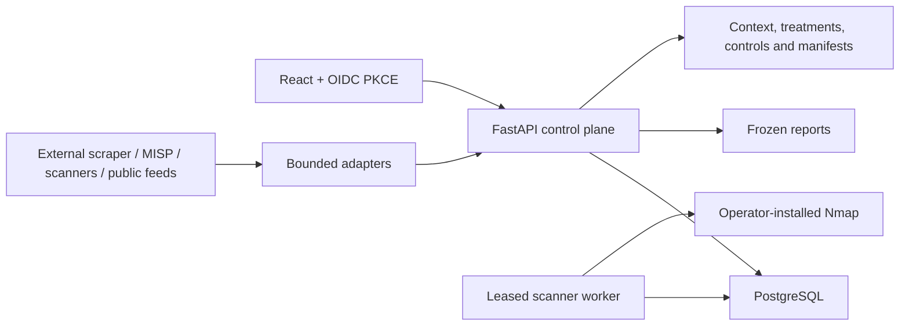

# Architecture

## Direction

Traceless is a modular monolith with a React client, a typed FastAPI control plane
and PostgreSQL as the system of record. Scanner execution and extension modules are
out of process. The API is not a privileged scanner or a plugin host.

The customer-local operational and governance workspaces are product surfaces. The
end-to-end demo surface remains available only when explicitly enabled and is hidden
from normal production builds.

## Product hierarchy

`Organization → Project → SecuritySystem → Observation/Scan → Asset/Finding → Architecture/Threat/Risk → Treatment/Control → Report`

- An organization is the enforced request and data boundary.
- A project groups systems inside an organization.
- A security system is the environment, application or network area being assessed.
- Assets and findings have stable identities across observation runs, with first/last
  seen metadata and explicit lifecycle transitions.
- Editing architecture creates an immutable successor with optimistic concurrency.
- Business context has its own immutable version stream and publication state. It is
  not changed merely because a diagram changes.
- Risk treatments are persistent work objects with owner, SLA/deadline, approval,
  verification and residual-risk state.
- Controls are named implementations with immutable point-in-time assessments.
- Analysis manifests freeze the exact source identities used for a governance decision.
- Reports freeze one coherent source view: PostgreSQL uses a single repeatable-read
  transaction, while local/test databases require matching consecutive source
  fingerprints. Inventory rows are anchored to the selected completed scan. The
  frozen risk register retains closed risks tied to retired threats; management
  priorities include only open risks in the current evidence set.

## Evidence and lifecycle

Imported scanner observations are retained even when they have no CVE or cannot yet
be matched. Correlation may be rerun after inventory changes. Evidence records carry
source, timestamps and strength so generic enrichment cannot silently replace
stronger scanner evidence. A later observation can close or reopen the same finding
and linked risk rather than creating an unrelated record.

The finding lifecycle is:

`open ↔ reopened → fixed | accepted | false_positive | out_of_scope`

The treatment lifecycle is:

`proposed → approved → in_progress → verification → closed`

`cancelled` is terminal. Closure requires verification criteria and a residual-risk
assessment. Analyst decisions and source observations remain distinct audit events.

## Assets are not architecture components

| Concept | Meaning | Created by discovery? | Current rule |
|---|---|---:|---|
| Asset | Reconciled runtime entity | Yes | Stable identity plus observation history |
| Observed topology | Graph derived from one or more observations | Yes | Separate version stream |
| Architecture component | Intentional design object | No | Immutable manual versions |
| Proposed change | Difference suggested by evidence | Yes | Must not overwrite manual architecture |

A new scan never becomes the current manual architecture. Formal asset-to-component
binding review and published architecture approval are still pending.

## Business-context and risk boundary

A system context version records business owner, capabilities, processes, data
categories, regulations, RTO/RPO and a multidimensional impact profile. One version
may be published at a time. Contextual risk reassessment records the exact published
version in each updated risk rationale.

Technical severity, exploit probability, known exploitation, evidence confidence,
reachability, control evidence and business impact remain separate inputs. The
operational posture indicator is a presentation signal and not an externally validated
security score.

A legacy risk retains one primary generated source for compatibility. Supplementary
`risk_evidence_links` allow findings, threats, architecture, controls, attack-chain
analyses and manual reviewed evidence to support the same decision without merging
their source records.

## Identity and tenant boundary

OIDC access tokens are verified locally from operator-configured RS256 keys, issuer
and audience. The authenticated principal supplies one organization and a fixed
operational role set. A separately configured service principal supports machine
integrations. Request repositories filter organization-owned data and internal
workers must opt into an explicit unscoped repository.

Request repositories enforce organization plus explicit project/system assignments.
PostgreSQL adds forced tenant RLS for the non-owner API role; a Session hook restores
the transaction-local tenant context after every commit. Governance tables are system-,
risk- or control-scoped and receive the same forced RLS boundary. The non-bypass worker
role cannot read any tenant queue directly without a tenant GUC. Audited
`SECURITY DEFINER` functions lock and return minimal dispatch headers. A claim carries
the organization identifier, and every worker session binds that tenant before reading
or writing tenant data. Lease expiry and schedule eligibility use the database clock.

## Intelligence boundary

Scraping is intentionally outside Traceless. A separately deployed program gathers
and analyzes sources, then exposes normalized cursor-paginated datapoints. Traceless
can pull bounded pages from one fixed, allowlisted HTTPS URL or receive the canonical
push contract. Source material and AI classification have separate hashes, versions,
timestamps and lifecycle states.

Official CISA KEV, FIRST EPSS and NVD inputs remain separate authoritative adapters.
Generic or AI-derived records cannot assert official KEV membership.

## Extension boundary

Modules communicate through versioned API/event contracts and run out of process.
The registry validates capabilities and permissions but never imports or executes
plugin code. NetBox is a bounded read-only connector whose snapshots remain
unreviewed until an analyst promotes a change.

The extension framework should not expand further until one production work-item or
inventory connector proves the contract end to end.

## Remaining architectural work

- Formal architecture publication, asset/component bindings and proposed-change review.
- Generic work-item synchronization followed by one Jira production adapter.
- Period-over-period risk, treatment and coverage projections.
- Asynchronous high-volume correlation and object-storage-backed payloads/downloads.
- Optional separate dispatcher/executor roles, signed remote jobs and mTLS.
- HA/restore evidence, production observability and offline signed feed bundles.
- System-grounded attack paths and safe what-if simulation.
